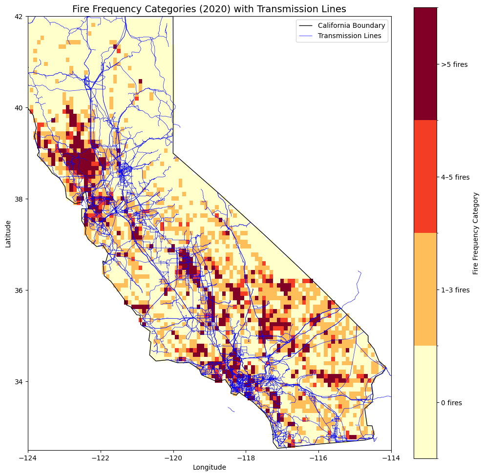
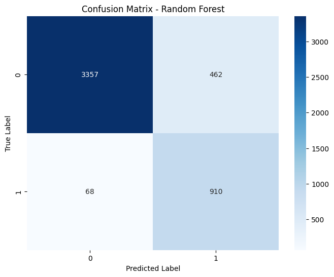
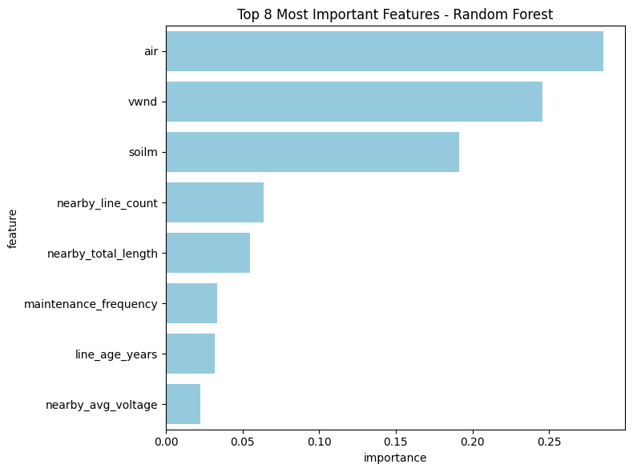

```{r setup, include=FALSE}
knitr::opts_chunk$set(echo = FALSE)
```

# Introduction

Climate change is mostly to blame for the increased frequency, intensity, and destructiveness of wildfires, especially in states like California. This has had a devastating impact on the environment, ecosystems, climate and human health[1].

This project aims to analyze the relationship between power grid characteristics and fire ignition risks in California, focusing on the factors such as voltage, proximity to vegetation, and infrastructure condition. The results of this research are essential to developing wildfire risk models, developing mitigation plans, and assisting in the formulation of laws pertaining to grid management and fire safety.

```{r, out.width='60%', fig.align='center'}

```

# Methods

For the transmission data, due to its characteristic of the line, making it challenging to match the fire data with the powerline. When merging the datasets, instead of matching the power line by the particular line, we calculate the number of lines near the fire ignition.

```{r, out.width='50%', fig.align='center'}
knitr::include_graphics("plots/trans_fire.png")
```

Power infrastructure evolves over time with new lines being built, old ones decommissioned, upgrades to existing lines, and changes in maintenance practices. These shifts can introduce biases when analyzing historical fire data. Fires may be incorrectly linked to power lines that didn’t exist or miss associations with lines no longer in use.
These challenges make implementing time-series analysis infeasible for this project, as the temporal inconsistencies would undermine the validity of the results.

## Models

Two Model was implemented for this project: Random Forest and XGBoost.
Random Forest: interpretable and robust, providing a baseline understanding of the problem.
XGBoost: the ability to handle heterogeneous datasets, capture nonlinear relationships, and provide insights into feature importance.

SMOTE were implemented due to the imbalanced data.

# Results

We evaluated the performance of Random Forest and XGBoost models for predicting wildfire occurrence using the dataset enriched with transmission line features. Both models were assessed based on accuracy, precision, recall, F1-score, ROC-AUC, and feature importance.

## Random Forest Results
Performance Metrics: The model excelled at classifying non-fire events, with a precision of 98% and a recall of 88%, meaning it was highly reliable in identifying areas without fires. For fire events, the model demonstrated reasonable accuracy, achieving a precision of 66% and an impressive recall of 93%, ensuring that most fire events were detected.

Classification Report:
              precision    recall  f1-score   support

           0       0.98      0.88      0.93      3819
           1       0.66      0.93      0.77       978

    accuracy                           0.89      4797
    ROC-AUC Score: 0.9595545574249086

<div style="display: flex; justify-content: space-between; align-items: center;">
  
  
</div>

## XGBoost Results
Performance Metrics: the model excelled in detecting fire events, achieving a high recall of 96%, meaning it successfully identified the vast majority of fire occurrences. However, its precision for fire events was slightly lower at 63%, indicating more false positives compared to Random Forest.

Classification Report:
              precision    recall  f1-score   support

           0       0.99      0.85      0.92      3819
           1       0.63      0.96      0.76       978

    accuracy                           0.88      4797
    ROC-AUC Score: 0.9619128017216683

<div style="display: flex; justify-content: space-between; align-items: center;">
  
  
</div>

# Conclusion

Both the Random Forest and XGBoost models demonstrated strong performance in predicting fire occurrences, with high overall accuracy and excellent discriminative ability reflected in ROC-AUC scores of 0.96. The Random Forest model excelled in precision for non-fire events, achieving 98%, while maintaining reasonable recall for fire events at 93%. On the other hand, XGBoost showed superior recall for fire events at 96%, making it highly effective at identifying areas prone to fire, though with slightly lower precision compared to Random Forest.
These results highlight the strengths of each model: Random Forest provides a balanced approach with high precision for non-fire events, while XGBoost offers robust recall for fire detection. Together, they underscore the utility of machine learning in understanding fire risk, with each model catering to different priorities depending on whether minimizing false positives or maximizing fire detection is the primary objective. 

# Limitation/Next Steps

Preform Time Series for transmission line data. Due to the limitation of the dataset, the powerline transmission data is a more static dataset, which it does contains the creator year. However, we do not have the full view of the transmission dataset for every year, which causing limitations for the model to preform time series prediction. 

# References
[1] World Meteorological Organization (WMO). ”Drought and heat exacerbate wildfires,” 01/24/2023.
[2] Yaling Liu, Son Le, Yufei Zou, Mojtaba Sadeghi, Yang Chen, Pierre Gentine, Niels Andela. "A Simplified Machine Learning Based Wildfire Ignition Model from Insurance Perspective," Presented at ICLR 2023.
